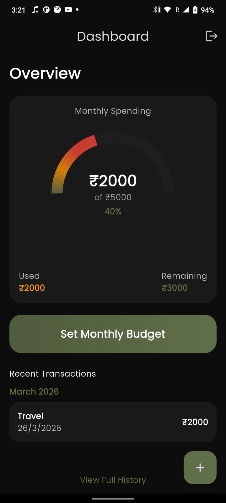
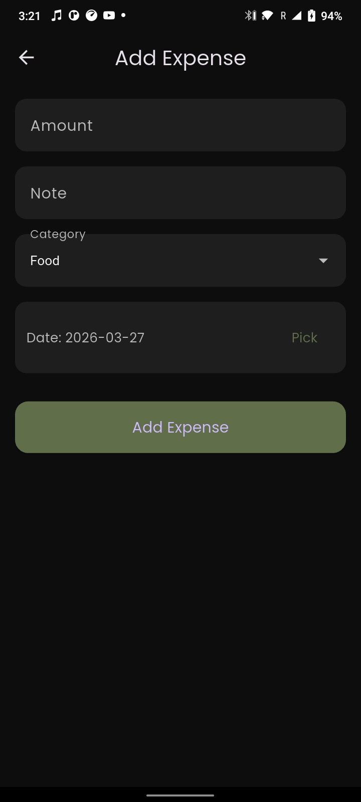
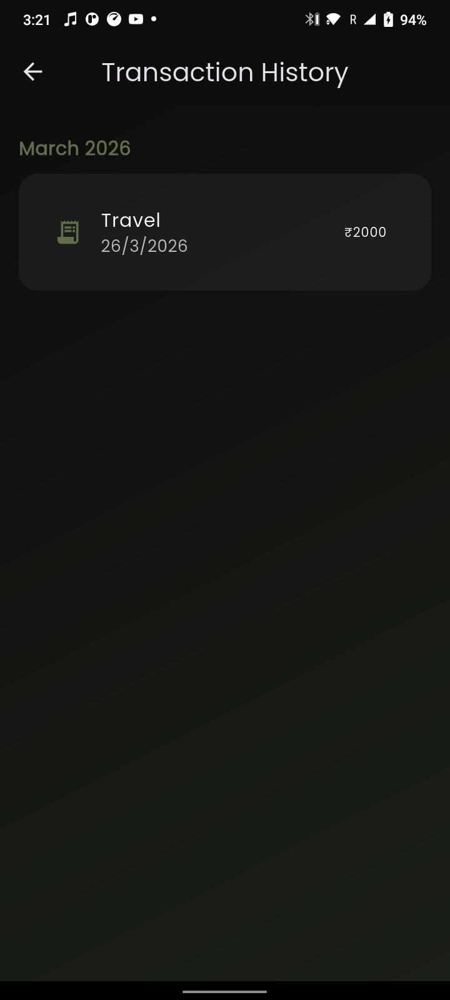

# 💸 Expense Tracker App

A full-stack **Expense Tracker App** built with **Flutter (Frontend)** and **FireBase + Node.js + Express + MongoDB (Backend)**.
It helps users manage daily expenses, set monthly budgets, and track spending visually.

---

## 🚀 Live Demo

🔗 **Frontend (APK / App):** *Coming Soon*
🔗 **Backend API:** *Coming Soon*

---

## 📸 Screenshots

### 📊 Dashboard



---

### ➕ Add Expense



---

### 📜 Transaction History



---

### 🎯 Monthly Budget


---

## ✨ Features

* 🔐 User Authentication (JWT आधारित)
* 📊 Dashboard with spending insights
* 💸 Add / Delete Expenses
* 📅 Monthly Budget Management
* 📜 Transaction History (grouped by month)
* 🔄 Pull-to-refresh support
* 🧹 Reset All Data (Full cleanup)
* 🔒 Secure token storage (Flutter Secure Storage)
* ⚡ Smooth UI with animations & shimmer loading

---

## 🛠️ Tech Stack

### 📱 Frontend

* Flutter
* Dart
* Shimmer
* Syncfusion Gauges

### 🌐 Backend

* Node.js
* Express.js
* MongoDB (Mongoose)
* JWT Authentication

---

## 📂 Project Structure

```bash
expense_tracker/
│
├── expense_frontend/   # Flutter App
│   ├── lib/
│   ├── assets/
│
├── expense_backend/    # Node.js Backend
│   ├── routes/
│   ├── models/
│   ├── controllers/
```

---

## ⚙️ Installation & Setup

### 🔹 1. Clone Repository

```bash
git clone [https://github.com/your-username/expense-tracker.git](https://github.com/Karanx11/Expense-Tracker.git)
cd expense-tracker
```

---

### 🔹 2. Backend Setup

```bash
cd expense_backend
npm install
```

Create `.env` file:

```env
PORT=5000
MONGO_URI=your_mongodb_uri
JWT_SECRET=your_secret_key
```

Run server:

```bash
npm run dev
```

---

### 🔹 3. Frontend Setup

```bash
cd expense_frontend
flutter pub get
```

Update API base URL in:

```dart
ApiService.baseUrl
```

Run app:

```bash
flutter run
```

---

## 🔥 API Endpoints

| Method | Endpoint      | Description        |
| ------ | ------------- | ------------------ |
| POST   | /auth/signup  | Register user      |
| POST   | /auth/login   | Login user         |
| GET    | /dashboard    | Get dashboard data |
| POST   | /expenses     | Add expense        |
| DELETE | /expenses/:id | Delete expense     |
| POST   | /limit        | Set monthly limit  |
| DELETE | /reset        | Reset all data     |

---

## 🧠 Learnings

* Full-stack app development (Flutter + Node.js)
* REST API integration
* JWT authentication flow
* MongoDB data handling
* Debugging real-world issues (ObjectId vs String)

---

## 📌 Future Improvements

* 📊 Charts & Analytics
* ☁️ Cloud Deployment
* 🔔 Notifications
* 📤 Export reports (PDF/Excel)
* 🤖 AI-based expense insights

---

## 👨‍💻 Author

**Karan Sharma**
🎓 B.Tech CSE (AI & ML)
💼 Aspiring Full Stack Developer

---

## ⭐ Show Your Support

If you like this project, give it a ⭐ on GitHub!
